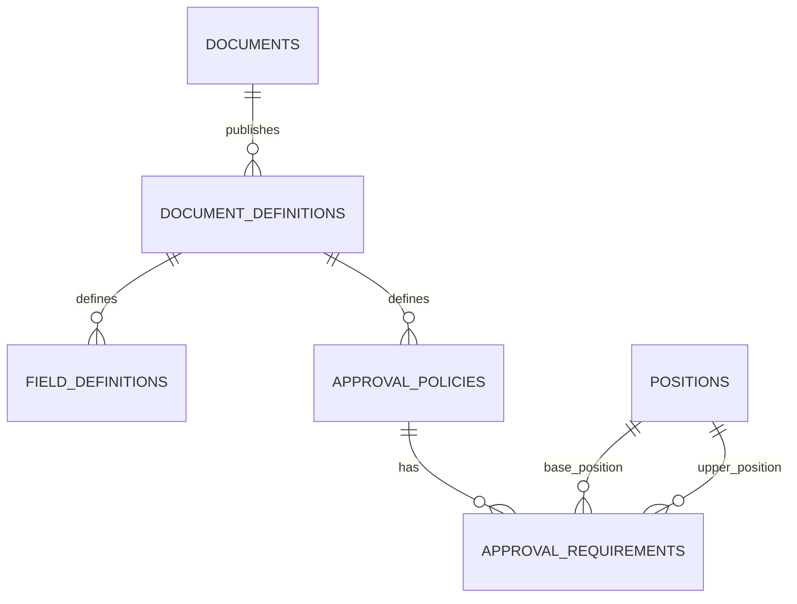
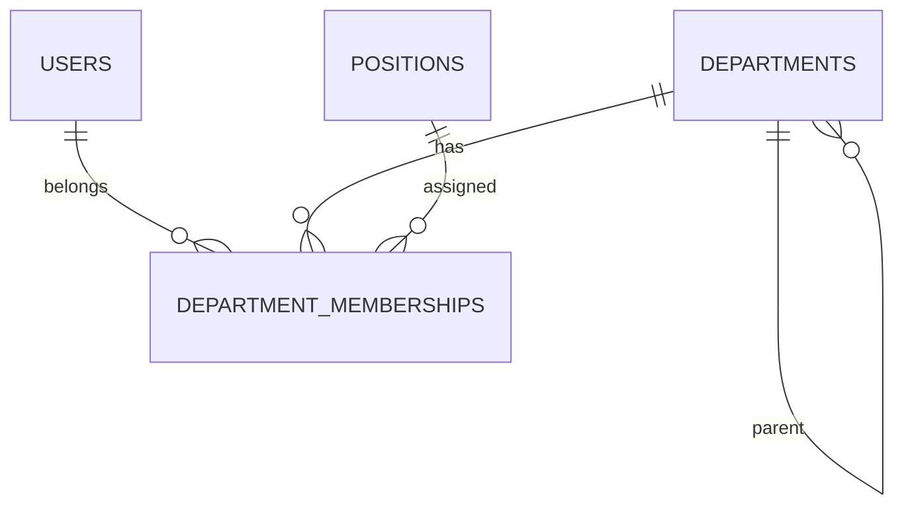
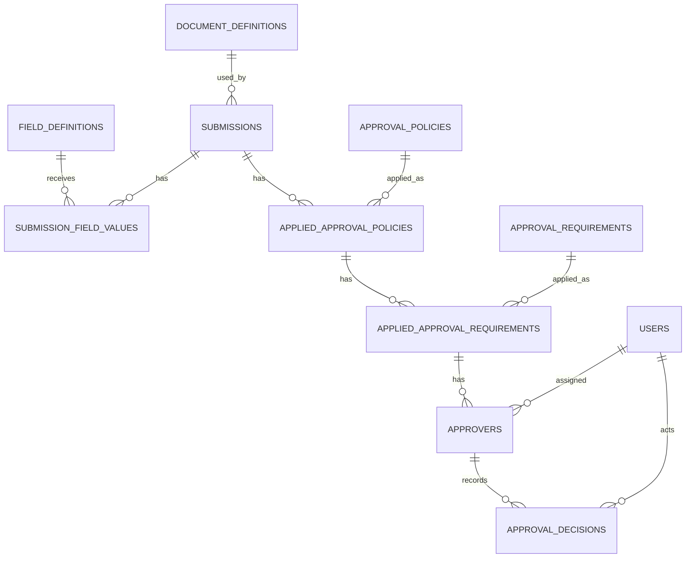

# ER Diagram

## 概要

本ドキュメントは MVP 時点の ER 図を定義する。

可読性を優先し、以下の 3 つに分割する。

- Document Definition
- Organization
- Submission Approval

---

# Document Definition

申請書定義に関するエンティティ。



## 補足

### documents.current_document_definition_id

現在公開中の DocumentDefinition を指す。

```text
Document
 ├ Definition v1
 ├ Definition v2
 └ Definition v3 ← current
```

---

# Organization

組織構造に関するエンティティ。



## 補足

Department は階層構造を持つ。

例:

```text
社長
└ 営業本部
   ├ 第一営業部
   └ 第二営業部
```

DepartmentMembership は所属履歴を保持する。

```text
近藤

2026-01-01 ～ 2026-06-30
第一営業部

2026-07-01 ～
開発部
```

---

# Submission Approval

実際の申請と承認に関するエンティティ。



## 補足

### submissions.current_applied_approval_policy_id

現在承認中の AppliedApprovalPolicy を指す。

例:

```text
Policy 1 (approved)
 ↓
Policy 2 (current)
 ↓
Policy 3 (pending)
```

---

# 承認モデル

承認に関する責務を整理すると以下のようになる。

```text
ApprovalPolicy
↓
ApprovalRequirement
↓
AppliedApprovalPolicy
↓
AppliedApprovalRequirement
↓
Approver
↓
ApprovalDecision
```

## ApprovalPolicy

定義。

どの条件で承認フローを適用するかを表す。

例:

```text
申請額 >= 300,000
```

---

## ApprovalRequirement

定義。

どのような承認者が必要かを表す。

例:

```text
同一部門の係長以上 3名
```

---

## AppliedApprovalPolicy

実行時データ。

この申請で適用された ApprovalPolicy を表す。

例:

```text
Policy A → 適用
Policy B → 適用
Policy C → 不適用
```

---

## AppliedApprovalRequirement

実行時データ。

ApprovalRequirement の達成状況を管理する。

例:

```text
必要承認数: 3
承認済み: 2
状態: pending
```

---

## Approver

実行時データ。

承認候補者ごとの状態を管理する。

例:

```text
田中: approved
鈴木: approved
佐藤: pending
高橋: pending
```

---

## ApprovalDecision

履歴データ。

誰が、いつ、どのような判断を行ったかを記録する。

例:

```text
田中
2026-06-24 09:30
approved
```

---

# 承認状態の流れ

```text
Submission
 └ AppliedApprovalPolicy
    └ AppliedApprovalRequirement
       └ Approver
          └ ApprovalDecision
```

## 例

```text
経費申請

Policy
 └ 部長承認

Requirement
 └ 部長 1名

Approver
 └ 田中部長

Decision
 └ approved
```

承認完了後

```text
Approver.status = approved

↓

AppliedApprovalRequirement.status = approved

↓

AppliedApprovalPolicy.status = approved

↓

Submission.status = approved
```
